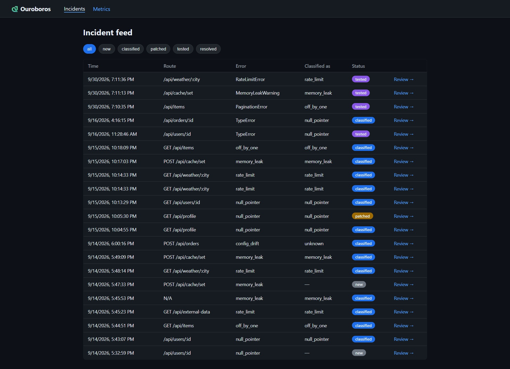
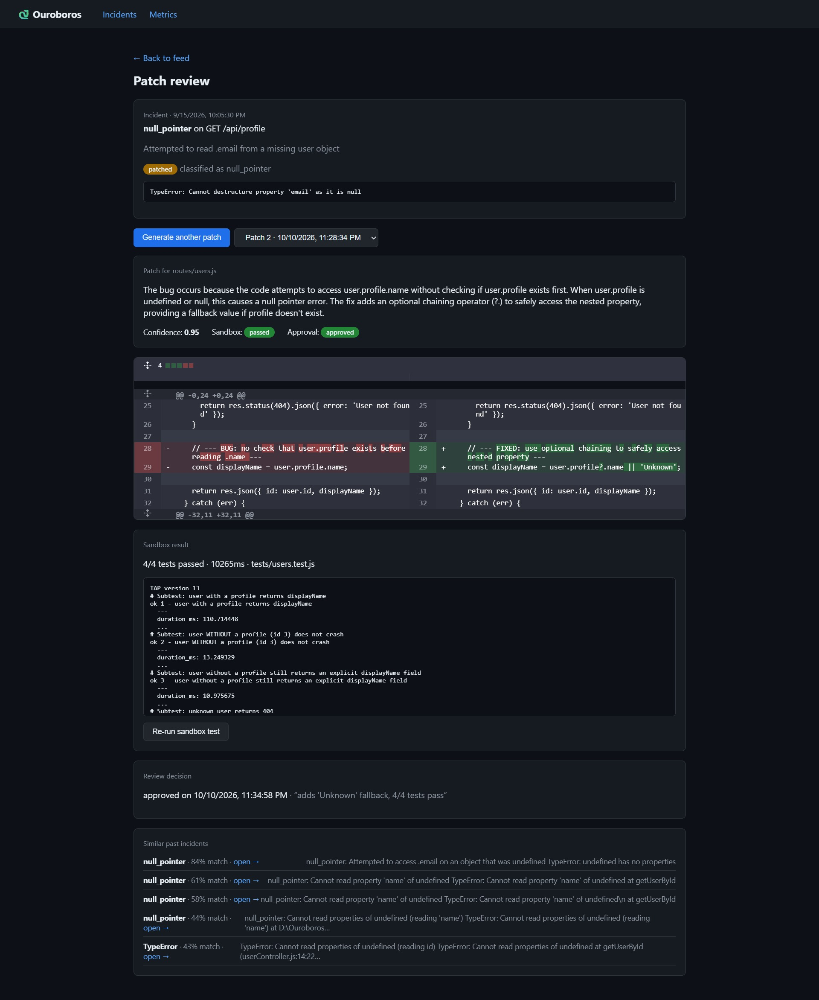

# Ouroboros: Self-Healing CI/CD Pipeline

> A deployment pipeline that consumes its own failure history to heal itself.

Ouroboros ingests production errors, classifies them, finds similar past incidents, asks an LLM for a candidate patch, tests that patch in an isolated Docker sandbox, and puts a human approval gate before anything ships.




## How it works

1. **Ingest**: errors from the sample app arrive at `POST /api/incidents/ingest`.
2. **Classify**: rules first, LLM fallback. Types include `null_pointer`, `memory_leak`, `rate_limit`, `off_by_one` and `config_drift`.
3. **Remember**: each incident is embedded (MiniLM, 384 dims) and stored in Supabase pgvector. Similar past incidents are retrieved by cosine similarity.
4. **Patch**: Claude (Anthropic API) generates a fix, given the incident and code context.
5. **Test**: the patch runs against the test suite in a Docker container with no network, a read-only filesystem, and memory/CPU/time limits.
6. **Review**: a human approves or rejects in the dashboard. Approve is locked unless the sandbox passed.

## Tech stack

| Layer | Tech |
|---|---|
| Backend | Node.js, Express, MongoDB (Mongoose) |
| Dashboard | React, Vite, React Router |
| Vector search | Supabase pgvector, `@xenova/transformers` |
| LLM | Anthropic API |
| Sandbox | Docker |

## Repo layout

apps/
backend/ Express API (incidents, patches, metrics)
dashboard/ React dashboard (feed, patch review, metrics)
sample-buggy-app/ the “production” app seeded with 4 bug patterns
infra/ Dockerfile for the sandbox, DB seeds and migrations
docs/ architecture and demo script


## Run it locally

Prerequisites: Node 20+, Docker Desktop, a MongoDB URI, a Supabase project, an Anthropic API key.

```powershell
# backend
cd apps\backend
copy .env.example .env    # then fill in your keys
npm install
npm run dev               # http://localhost:5000

# dashboard (second terminal)
cd apps\dashboard
npm install
npm run dev               # http://localhost:5173
```

## API

| Route | Purpose |
|---|---|
| `POST /api/incidents/ingest` | ingest and classify an error |
| `GET /api/incidents` | list incidents |
| `GET /api/incidents/:id/similar` | similar past incidents |
| `POST /api/patches/:id/generate` | generate a patch (incident id) |
| `GET /api/patches/:id` | patches for an incident |
| `POST /api/patches/:id/test` | run the sandbox test (patch id) |
| `POST /api/patches/:id/approve` and `/reject` | human review (patch id) |
| `GET /api/patches/:id/original` | original file for the diff (patch id) |
| `GET /api/metrics` | dashboard metrics |

## Safety

Patches are never applied automatically. Every patch must pass the sandbox tests and be approved by a human. Weak patches are caught: for the profile bug, two of three generated patches dropped a response field and failed the sandbox.

## Status

- [x] Phases 1-3: sample app, ingestion, classification, vector search
- [x] Phase 4: LLM patch generation
- [x] Phase 5: Docker sandbox test runner
- [x] Phase 6: dashboard, approve/reject, metrics
- [ ] Phase 7: auto-retry with failure feedback, apply approved patches, outcome check
